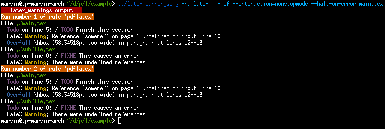

# latex-warnings
A commandline wrapper for a latex process that parses errors and warnings,
and appends to the output in a better understandable format.

## Usage

Simply prefix your tex-output producing command with this wrapper:

```
latex_warnings.py latex ...
latex_warnings.py latexmk ...
latex_warnings.py pdflatex ...
```

## Example Output



## CLI

```
usage: latex_warnings [options] <latex commandline>...

Wraps a latex commandline, and parses its output to produce more readable
warnings. Example: `latex_warnings -a latexmk -pdf foo.tex`

optional arguments:
  -h, --help         show this help message and exit
  -w, --warnings     output warnings.
  -e, --errors       output errors.
  -b, --warn-box     output overfull and underfull box warnings.
  -t, --warn-todo    output todo warnings.
  -f, --all-files    print all processed file paths, not just *.tex.
  -n, --no-raw       do not output the raw stdout and stderr of the wrapped
                     process.
  -l, --last-run     only output warnings from the last run. This conflicts
                     with -i.
  -i, --interleaved  print the output interleaved with the raw output. This
                     allows interactive and endless commandlines.
  -a, --all          enables all generally useful warnings. implies -webt.
  -V, --verbose      enables all possible warnings. implies -af.
```

## How it works

- It runs the command, and lets it print to stdout as usual.
- It capture stderr and redirects it into the stdout stream.
- It replaces the default 80-column line width of tex commands with a large value via a environment variable to effectively disable it.
- It collects the combined output, and scans it for warnings and errors.
- It will try to open all `.tex` files encountered in the output
  and case-insensitive search it for `todo` or `fixme` annotations.
- It will _colorize_ the processed list of warnings to make it easier to read.
